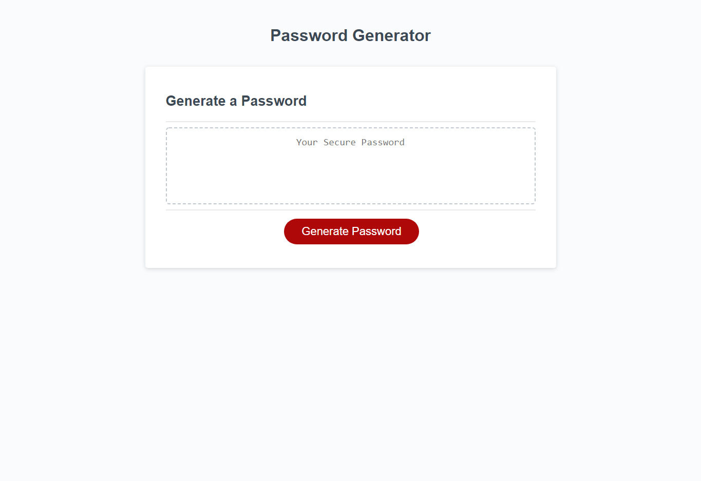

# Password-Generator
## Table of Contents

* [Description](#description)
* [Visuals](#visuals)
* [Link](#link-to-site)

## Description
03-JavaScript

 I used javascript to create a random password generator that takes in inputs from the user. Based on what the user inputs, the password can have 8 - 128 characters in length. As well as include lowercase letters, uppercase letters, numbers, and special characters based on what the user desires. 

## Visuals

## Link to Site
[https://supernaldeity.github.io/Password-Generator/]